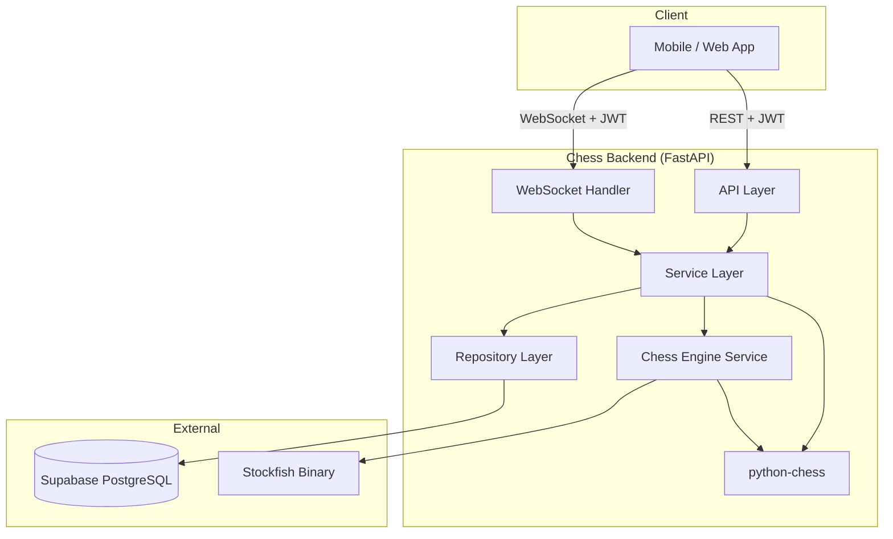
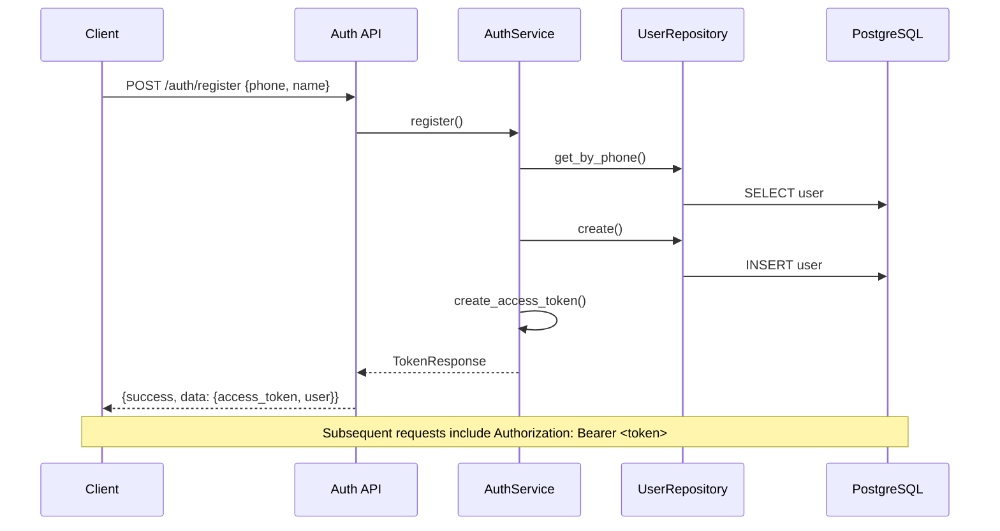
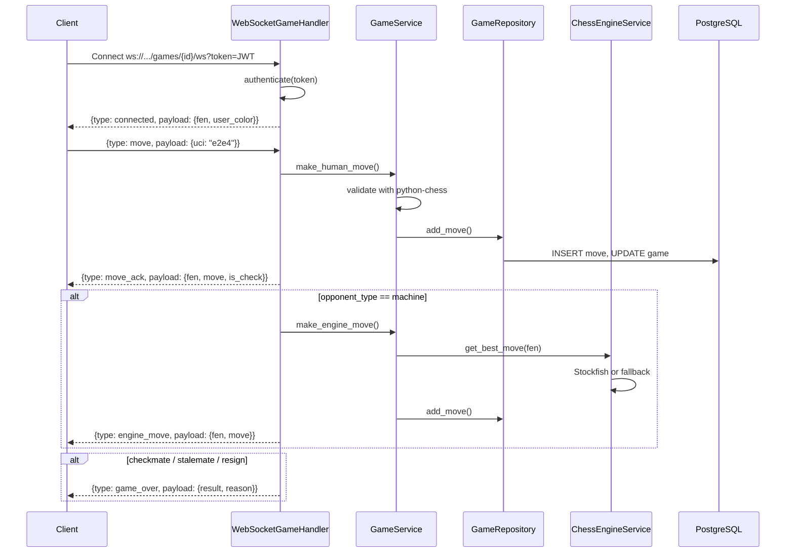
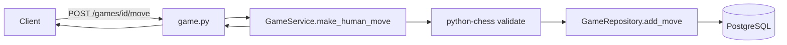

# Chess Backend API

A production-ready chess backend built with **FastAPI**, **PostgreSQL (Supabase)**, and **WebSockets**. It supports phone-based authentication, human-vs-machine gameplay, real-time move exchange, and optional Stockfish engine integration.

| | |
|---|---|
| **Version** | `1.0.0` |
| **Python** | 3.9 – 3.12 |
| **Package** | `chess-backend` (installable module) |
| **API prefix** | `/api/v1` |
| **Docs** | `/docs` (Swagger UI) · `/redoc` (ReDoc) |

---

## Table of Contents

1. [Overview](#overview)
2. [Tech Stack](#tech-stack)
3. [Architecture & Design Decisions](#architecture--design-decisions)
4. [What Is Stockfish?](#what-is-stockfish)
5. [Data Flow](#data-flow)
6. [Project Structure](#project-structure)
7. [Database Schema](#database-schema)
8. [API Reference](#api-reference)
9. [WebSocket Protocol](#websocket-protocol)
10. [Getting Started](#getting-started)
11. [Deployment](#deployment)
12. [Versioning](#versioning)
13. [Environment Variables](#environment-variables)
14. [Testing](#testing)
15. [Further Reading](#further-reading)

---

## Overview

This backend powers a chess application where users:

1. **Register / log in** with a phone number and display name
2. **Create games** against a machine opponent (or human — schema-ready)
3. **Play in real time** over WebSocket with structured JSON messages
4. **Fall back to REST** for moves, game state, and account management

The server validates every move with **python-chess**, persists game history to **Supabase PostgreSQL**, and optionally replies using the **Stockfish** chess engine.

---

## Tech Stack

| Layer | Technology | Why |
|-------|------------|-----|
| **Runtime** | Python 3.9+ | Async support, rich ecosystem, easy deployment |
| **Web framework** | [FastAPI](https://fastapi.tiangolo.com/) | Async-native, automatic OpenAPI/Swagger, Pydantic integration |
| **ASGI server** | [Uvicorn](https://www.uvicorn.org/) | High-performance ASGI server; `[standard]` extra adds uvloop on supported hosts |
| **ORM** | [SQLAlchemy 2.0](https://www.sqlalchemy.org/) (async) | Mature ORM with async sessions and PostgreSQL enum support |
| **Database driver** | [asyncpg](https://github.com/MagicStack/asyncpg) | Fastest async PostgreSQL driver for Python |
| **Database** | [Supabase](https://supabase.com/) (PostgreSQL) | Managed Postgres, connection pooling, optional Auth JWT verification |
| **Migrations** | [Alembic](https://alembic.sqlalchemy.org/) | Version-controlled schema changes (build/deploy step) |
| **Validation** | [Pydantic v2](https://docs.pydantic.dev/) | Request/response validation, settings management |
| **Auth** | [PyJWT](https://pyjwt.readthedocs.io/) | Lightweight HS256 JWT for phone login tokens |
| **Chess logic** | [python-chess](https://python-chess.readthedocs.io/) | Move validation, FEN/PGN, checkmate/stalemate detection |
| **Chess engine** | [Stockfish](https://stockfishchess.org/) (optional) | World-class open-source engine for machine opponent |
| **Real-time** | WebSockets (FastAPI / Starlette) | Low-latency bidirectional gameplay |
| **Config** | [python-dotenv](https://github.com/theskumar/python-dotenv) + pydantic-settings | 12-factor config via environment variables |
| **Packaging** | `pyproject.toml` + setuptools | Installable module with optional dependency groups |

### Optional / dev-only

| Package | Extra | Purpose |
|---------|-------|---------|
| `stockfish` | `[engine]` | Python wrapper around Stockfish binary |
| `alembic`, `psycopg` | `[migrate]` | Sync driver for migration CLI |
| `uvicorn[standard]`, `websockets` | `[server]` | Faster local/production server |
| `pytest`, `httpx` | `[dev]` | Test suite |

Core production install intentionally excludes heavy packages (bcrypt, Stockfish binary wrapper, Alembic) to keep free-tier deploys lean. See [Deployment](#deployment).

---

## Architecture & Design Decisions

The codebase follows **Clean Architecture** (ports & adapters): dependencies point inward; business logic never imports HTTP or database details directly.

```
┌─────────────────────────────────────────────────────────────┐
│  API Layer          auth · user · game · health · WebSocket │
├─────────────────────────────────────────────────────────────┤
│  Service Layer      auth · user · game · engine · ws        │
├─────────────────────────────────────────────────────────────┤
│  Repository Layer   user_repository · game_repository       │
├─────────────────────────────────────────────────────────────┤
│  Models / Schemas   SQLAlchemy ORM · Pydantic DTOs          │
└─────────────────────────────────────────────────────────────┘
         │                              │
         ▼                              ▼
   PostgreSQL (Supabase)         Stockfish (optional)
```

### 1. Layered separation

| Layer | Responsibility | Rule |
|-------|----------------|------|
| **`app/api/`** | HTTP/WebSocket adapters, routing, status codes | No business logic |
| **`app/services/`** | Rules, orchestration, chess/engine logic | Calls repositories, not raw SQL |
| **`app/repositories/`** | CRUD and queries | No HTTP or chess rules |
| **`app/models/`** | SQLAlchemy entities | Database shape only |
| **`app/schemas/`** | Pydantic request/response DTOs | Validation & serialization |
| **`app/dependencies/`** | FastAPI DI wiring | Composes services per request |
| **`app/core/`** | Config, DB engine, security, logging | Shared infrastructure |
| **`app/middleware/`** | CORS, logging, global error envelope | Cross-cutting concerns |
| **`app/utils/`** | Chess helpers, domain exceptions | Pure utilities |

**Why:** Each layer can be tested and replaced independently (e.g. swap Supabase for self-hosted Postgres without touching API routes).

### 2. Dependency injection

FastAPI `Depends()` injects repositories and services per request. Database sessions are request-scoped with automatic commit/rollback.

**Why:** Explicit dependencies, easy mocking in tests, no global state for DB access.

### 3. Async-first database access

SQLAlchemy `AsyncSession` + `asyncpg` for all REST handlers. WebSocket handlers use a dedicated session per connection.

**Why:** Non-blocking I/O under concurrent players; aligns with FastAPI's async model.

### 4. Consistent JSON envelope

Every REST response uses the same shape:

```json
{
  "success": true,
  "message": "Human-readable summary",
  "data": { }
}
```

Errors return `success: false` with an `error` object (`code`, `message`, optional `details`).

**Why:** Frontend clients can handle success/failure uniformly without parsing framework-specific error formats.

### 5. Phone-based JWT auth (dummy account model)

Registration stores `phone` + `name`. Login issues a signed JWT (`sub` = user UUID). No passwords — suitable for MVP/mobile OTP flows later.

**Why:** Minimal friction for demos; Supabase JWT verification is also supported in `security.py` for production Auth migration.

### 6. Dual transport: REST + WebSocket

| Transport | Use case |
|-----------|----------|
| **REST** | Auth, profile, create game, list games, fallback moves |
| **WebSocket** | Live gameplay — move, engine reply, resign, ping/pong |

**Why:** REST is cacheable and simple for CRUD; WebSocket avoids polling and enables instant engine replies.

### 7. WebSocket session manager

`WebSocketSessionManager` tracks one active connection per game. Reconnecting replaces the previous session.

**Why:** Prevents duplicate move streams from the same client opening multiple tabs.

### 8. Engine abstraction with fallback

`ChessEngineService` tries Stockfish when the binary exists; otherwise picks a random legal move via python-chess.

**Why:** Stockfish cannot run on many free serverless hosts (no binary, no subprocess). Games still work everywhere.

### 9. Installable Python module

Distributed via `pyproject.toml` with CLI entry point:

```bash
chess-backend serve
chess-backend migrate
```

**Why:** Single command deploy on Render/Railway/Docker; optional extras keep the default install small.

### 10. Migrations outside runtime

Alembic runs at **build/deploy** time, not on every request.

**Why:** Faster cold starts; schema changes are explicit and reviewable in PRs.

---

## What Is Stockfish?

**Stockfish** is a free, open-source chess engine consistently ranked among the strongest in the world. It evaluates positions and selects optimal moves using alpha-beta search, neural networks (in recent versions), and vast opening/endgame knowledge.

### Role in this project

| Component | Role |
|-----------|------|
| **Stockfish binary** | Separate OS executable (`stockfish` on PATH) |
| **`stockfish` Python package** | Optional wrapper that communicates via UCI protocol |
| **`ChessEngineService`** | Spawns engine per move, reads best move, shuts down cleanly |
| **Fallback** | Random legal move when binary is unavailable |

### Why Stockfish?

- **Strong play** — Provides a challenging machine opponent without writing custom AI
- **Industry standard** — UCI protocol, well-documented, widely deployed
- **Free & open source** — No licensing cost for hobby or commercial projects
- **Configurable strength** — `Skill Level` and think-time parameters tune difficulty

### Local setup (recommended for development)

```bash
# macOS
brew install stockfish

# Verify
which stockfish
```

Set in `.env` if needed:

```env
STOCKFISH_PATH=/opt/homebrew/bin/stockfish
STOCKFISH_SKILL_LEVEL=10
STOCKFISH_MOVE_TIME_MS=500
```

On cloud hosts without Stockfish, the backend **automatically degrades** to random legal moves — no crash, no extra config.

---

## Data Flow

### High-level system flow



### Authentication flow



### Real-time game flow (WebSocket)



### REST move flow (fallback)



---

## Project Structure

```
backend/
├── app/
│   ├── __init__.py
│   ├── __main__.py              # python -m app serve
│   ├── main.py                  # FastAPI app factory, CORS, routers
│   ├── cli.py                   # chess-backend CLI (serve, migrate, version)
│   │
│   ├── api/                     # ── HTTP / WebSocket adapters ──
│   │   ├── auth.py              # POST /auth/register, /auth/login
│   │   ├── user.py              # GET /users/me
│   │   ├── game.py              # Game CRUD, move, resign, WebSocket endpoint
│   │   └── health.py            # GET /health
│   │
│   ├── core/                    # ── Infrastructure ──
│   │   ├── config.py            # pydantic-settings (env vars)
│   │   ├── database.py          # Async engine, session, Base
│   │   ├── security.py          # JWT create/decode, Supabase JWT verify
│   │   └── logger.py            # Structured JSON/text logging
│   │
│   ├── models/                  # ── SQLAlchemy ORM ──
│   │   ├── user.py              # User (phone, name, is_active)
│   │   └── game.py              # Game, GameMove, enums (status, result, side)
│   │
│   ├── schemas/                 # ── Pydantic DTOs ──
│   │   ├── common.py            # APIResponse, ErrorResponse, pagination
│   │   ├── user.py              # Register/login/token schemas
│   │   ├── game.py              # Game create, move, state schemas
│   │   └── websocket.py         # WS message types and payloads
│   │
│   ├── repositories/            # ── Data access ──
│   │   ├── user_repository.py
│   │   └── game_repository.py
│   │
│   ├── services/                # ── Business logic ──
│   │   ├── auth_service.py
│   │   ├── user_service.py
│   │   ├── game_service.py      # Move validation, game lifecycle
│   │   ├── chess_engine_service.py  # Stockfish + fallback
│   │   ├── websocket_service.py     # WS message routing
│   │   ├── websocket_session_manager.py  # Active connection registry
│   │   └── game_session_service.py  # Session-level game helpers
│   │
│   ├── dependencies/
│   │   └── deps.py              # FastAPI Depends() providers
│   │
│   ├── middleware/
│   │   ├── logging_middleware.py    # Request ID, duration logging
│   │   └── exception_handlers.py    # Unified error JSON
│   │
│   └── utils/
│       ├── chess_utils.py       # Board, UCI, FEN, PGN helpers
│       └── exceptions.py        # AppException hierarchy
│
├── alembic/                     # Database migrations
│   ├── env.py
│   └── versions/
│       ├── 001_initial_schema.py
│       └── 002_game_session_clock.py
│
├── tests/
│   └── test_health.py
│
├── pyproject.toml               # Package metadata, deps, CLI entry point
├── requirements.txt             # Full dev install: -e ".[server,engine,migrate,dev]"
├── requirements-minimal.txt     # Production: -e ".[migrate]"
├── alembic.ini
├── Procfile                     # Railway / Heroku
├── render.yaml                  # Render Blueprint
├── Dockerfile
├── vercel.json                  # Vercel serverless (optional)
├── DEPLOY.md                    # Extended deployment guide
├── .env.example
└── README.md
```

---

## Database Schema

| Table | Purpose | Key columns |
|-------|---------|-------------|
| **`users`** | Player accounts | `phone` (unique), `name`, `is_active` |
| **`games`** | Chess sessions | `user_id`, `opponent_type`, `status`, `result`, `user_color`, `current_fen`, `pgn`, `move_count` |
| **`game_moves`** | Move history | `game_id`, `move_number`, `move_san`, `move_uci`, `fen_after`, `played_by` |

PostgreSQL enums: `opponent_type`, `game_status`, `game_result`, `player_side`.

Relations:

```
users 1 ──< * games 1 ──< * game_moves
```

---

## API Reference

Base URL: `/api/v1`

| Method | Endpoint | Auth | Description |
|--------|----------|------|-------------|
| `GET` | `/health` | No | Service health and version |
| `POST` | `/auth/register` | No | Create account `{phone, name}` → JWT |
| `POST` | `/auth/login` | No | Login `{phone}` → JWT |
| `GET` | `/users/me` | Bearer | Current user profile |
| `POST` | `/games` | Bearer | Create game `{opponent_type, user_color}` |
| `GET` | `/games` | Bearer | List games (paginated) |
| `GET` | `/games/{id}` | Bearer | Game details + move history |
| `GET` | `/games/{id}/state` | Bearer | Board state, legal moves, turn |
| `POST` | `/games/{id}/move` | Bearer | Apply move `{uci}` (REST fallback) |
| `POST` | `/games/{id}/resign` | Bearer | Resign game |
| `WS` | `/games/{id}/ws?token=` | Query JWT | Real-time gameplay |

Interactive documentation: **`/docs`** (Swagger) · **`/redoc`**

---

## WebSocket Protocol

**Endpoint:** `ws(s)://<host>/api/v1/games/{game_id}/ws?token=<JWT>`

### Client → Server

| type | payload | description |
|------|---------|-------------|
| `move` | `{ "uci": "e2e4" }` | Player move (UCI notation) |
| `resign` | `{}` | Forfeit the game |
| `ping` | `{}` | Keep-alive |
| `connect` | `{}` | Request fresh game state |

### Server → Client

| type | description |
|------|-------------|
| `connected` | Session established; includes FEN and player color |
| `move_ack` | Human move accepted; board flags (`is_check`, etc.) |
| `engine_move` | Machine reply (Stockfish or fallback) |
| `game_state` | Full board snapshot |
| `game_over` | Result and reason (`checkmate`, `draw`, `resignation`) |
| `error` | `{ code, message }` |
| `pong` | Ping response |

All messages share the envelope:

```json
{
  "type": "move_ack",
  "payload": { },
  "request_id": "optional-client-correlation-id"
}
```

---

## Getting Started

### Prerequisites

- Python **3.9+** (3.12 recommended)
- PostgreSQL database ([Supabase](https://supabase.com/) free tier works)
- **Stockfish** (optional, for strong machine opponent)

### Install

```bash
cd backend
python -m venv .venv
source .venv/bin/activate        # Windows: .venv\Scripts\activate

# Development (all extras)
pip install -r requirements.txt

# Production-minimal
pip install -r requirements-minimal.txt
```

### Configure

```bash
cp .env.example .env
# Edit DATABASE_URL, JWT_SECRET_KEY, CORS_ORIGINS
```

URL-encode special characters in database passwords (`@` → `%40`, `#` → `%23`).

### Migrate & run

```bash
chess-backend migrate
chess-backend serve --reload
```

Open http://localhost:8000/docs

### Quick smoke test

```bash
# Register
curl -s -X POST http://localhost:8000/api/v1/auth/register \
  -H "Content-Type: application/json" \
  -d '{"phone":"9876543210","name":"Alice"}' | jq

# Use access_token from response for authenticated calls
```

---

## Deployment

### Platform recommendations

| Platform | Backend | WebSocket | Best for |
|----------|---------|-----------|----------|
| **[Render](https://render.com/)** | Yes | Yes | Free-tier backend (recommended) |
| **[Railway](https://railway.app/)** | Yes | Yes | Simple git-push deploy |
| **[Fly.io](https://fly.io/)** | Yes | Yes | Docker + global regions |
| **[Vercel](https://vercel.com/)** | Serverless | Limited* | Testing / light traffic |
| **GitHub Pages** | No | No | Frontend static files only |

\* Vercel requires Fluid Compute for WebSockets; Stockfish unavailable; see `DEPLOY.md`.

### One-command production start

```bash
chess-backend serve --host 0.0.0.0 --port $PORT
```

### Render (recommended)

1. Push repo to GitHub
2. New **Web Service** → connect repo → root directory: `backend`
3. Uses `render.yaml` automatically, or set:
   - **Build:** `pip install -r requirements-minimal.txt && chess-backend migrate`
   - **Start:** `chess-backend serve --host 0.0.0.0 --port $PORT`
4. Set env vars: `DATABASE_URL`, `JWT_SECRET_KEY`, `CORS_ORIGINS`

### Docker

```bash
docker build -t chess-backend .
docker run -p 8000:8000 \
  -e DATABASE_URL="postgresql+asyncpg://..." \
  -e JWT_SECRET_KEY="your-secret-min-32-chars" \
  chess-backend
```

### Frontend + backend split

Host the **frontend** on Vercel or GitHub Pages. Point it at your backend URL:

```env
API_BASE_URL=https://your-backend.onrender.com/api/v1
WS_BASE_URL=wss://your-backend.onrender.com/api/v1
```

Full platform-specific steps: **[DEPLOY.md](./DEPLOY.md)**

---

## Versioning

This project uses **[Semantic Versioning 2.0.0](https://semver.org/)**.

| Component | Location | Example |
|-----------|----------|---------|
| Package version | `pyproject.toml` → `[project].version` | `1.0.0` |
| App version (runtime) | `APP_VERSION` env or `config.py` default | `1.0.0` |
| API version | URL prefix | `/api/v1` |
| DB schema | Alembic revision chain | `001_initial`, `002_game_session_clock` |

### Version bump policy

| Change | Bump | Example |
|--------|------|---------|
| Breaking API or schema change | **Major** | `1.0.0` → `2.0.0` |
| New endpoints, backward-compatible features | **Minor** | `1.0.0` → `1.1.0` |
| Bug fixes, dependency patches | **Patch** | `1.0.0` → `1.0.1` |

### Release checklist

1. Update `[project].version` in `pyproject.toml`
2. Add Alembic migration if schema changed
3. Update this README if architecture or API changed
4. Run `pytest`
5. Tag in git: `git tag v1.0.0`

Check running version:

```bash
chess-backend version
curl -s http://localhost:8000/api/v1/health | jq .data.version
```

---

## Environment Variables

| Variable | Required | Description |
|----------|----------|-------------|
| `DATABASE_URL` | Yes | Async Postgres URL (`postgresql+asyncpg://...`) |
| `JWT_SECRET_KEY` | Yes | Secret for signing tokens (min 32 chars) |
| `CORS_ORIGINS` | No | Comma-separated allowed origins |
| `ENVIRONMENT` | No | `development` / `production` |
| `LOG_LEVEL` | No | `INFO`, `DEBUG`, etc. |
| `LOG_FORMAT` | No | `json` or `text` |
| `STOCKFISH_PATH` | No | Path to Stockfish binary (default: `stockfish`) |
| `STOCKFISH_SKILL_LEVEL` | No | Engine difficulty 0–20 (default: `10`) |
| `STOCKFISH_MOVE_TIME_MS` | No | Think time in ms (default: `500`) |
| `SUPABASE_JWT_SECRET` | No | For Supabase Auth token verification |
| `PORT` | No | Set automatically on Render/Railway/Vercel |

See **[.env.example](./.env.example)** for a copy-paste template.

---

## Testing

```bash
pip install -e ".[dev]"
pytest
```

Tests live in `tests/`. CI should run migrations against a test database before integration tests are added.

---

## Further Reading

| Document | Contents |
|----------|----------|
| [DEPLOY.md](./DEPLOY.md) | Vercel, Render, Railway, Docker, env vars, Flutter client URLs |
| [.env.example](./.env.example) | Environment variable template |
| `/docs` | Live OpenAPI / Swagger (when server is running) |

---

## License

MIT — see `pyproject.toml` for package metadata.
